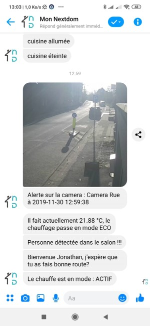
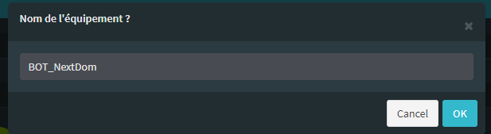
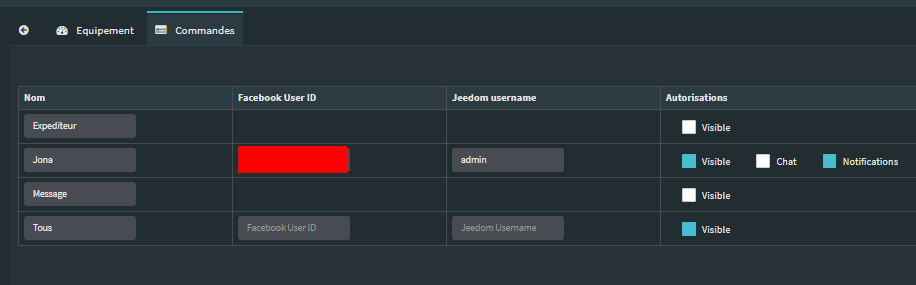

# Description 

Ce plugin permet d'établir une connexion entre Facebook Messenger et NextDom pour
envoyer des alertes à partir de NextDom.

Vous pourrez utiliser l'équipement une fois configuré directement dans un scénario ou sur le dashboard en manuel.
Il est aussi possible d'utiliser les interactions.

# Prérequis

Les prérequis suivant sont nécessaires pour faire fonctionner le plugin fbbot :
-   Disposer d'une URL externe pour NextDom
-   Être en https (imposé par Facebook)
-   Disposer d'un compte Facebook + Facebook Developper (simple et gratuit)
-   Installer le plugin Fbbot disponible sur le market NextDom

# Etapes d'installation

Ces étapes doivent être effectuées dans cet ordre afin de disposer des tokens
nécessaires pour autoriser l'interaction entre Facebook et votre NextDom.
Dans les prochaines étapes vous trouverez 3 éléments à conserver puisqu'il vous faudra les ajouter dans votre équipement NextDom :

Le "Facebook API Graph Access Token"
Le "App secret".
La "Page ID".

# Création de l'application Messenger

La première étape est de créer une page Facebook.
Pour créer une page Facebook aller sur <https://www.facebook.com/pages/create>

La création d'une page Facebook est imposée par Facebook pour tous les bots
Messenger. Cette page, publique, servira de profil public à votre bot.
Son nom et son avatar seront notamment
ceux qui s'afficheront dans Facebook Messenger, alors choisissez-bien.

Nul besoin de remplir les informations sur la page elle ne servira que pour notre bot.

Nous allons maintenant créer une application Facebook Messenger via ce lien

https://www.facebook.com/pages/create

Choisissez "Figure locale ou publique"

Saisissez le nom de votre page public ainsi qu'une catégorie à laquelle l'associer puis continuez.

Création de l'application Messenger. Pour ce faire, rendez-vous sur l'adresse suivante :

https://developers.facebook.com/apps

Cliquez sur le + pour ajouter une app

Renseignez ensuite un nom d'usage et validez votre adresse mail de contact.
Cliquez maintenant sur "Créer un ID app".

Une fois sur l'app cliquez sur le menu Tableau de bord et tout en bas sur Messenger

Associez ensuite votre page Facebook à votre application Messenger.

Modifiez les autorisations et générez un Facebook API Graph Access Token (à noter n'oubliez pas)
Suivez les instructions de sorte à sélectionner la page créée précédemment et acceptez la demande de droits.

Récupérons maintenant l'ID de la page Facebook. Pour ce faire, retournez sur votre page et modifiez-la.

Vous retrouverez l'ID de la page dans l'url...

Recherchons maintenant l'App secret que vous trouverez en retournant sur le tableau de bord de votre application :

https://developers.facebook.com/apps

Dans le menu Paramètres -> Général -> Clé secrète

Nous avons donc pu récupérer :

Le "Facebook API Graph Access Token"
Le "App secret"
La "Page ID"

# Configuration des équipements dans NextDom

Nous allons maintenant créer un équipement dans NextDom pour gérer notre bot.
Allez dans NextDom et choisissez "Fbbot" dans la liste des plugins.

Cliquer sur (+) pour ajouter un nouvel équipement.

Donner lui le nom de votre choix : BOT_NextDom dans mon cas

Vous retrouvez ici toute la configuration de votre équipement.
Vous devez absolument renseigner l'ensemble des champs suivants pour pouvoir
faire fonctionner votre équipement :
-   **Nom de l&#8217;équipement** : nom de votre équipement Fbbot
-   **Activer** : permet de rendre votre équipement actif
-   **Visible** : le rend visible sur le dashboard
-   **Page ID** : c'est l'ID de votre page Facebook que vous avez créé un peu
plus haut. Cette donnée est obligatoire. Elle est utilisée comme identifiant
logique dans NextDom et servira à distinguer vos différents bots si vous en
créez plusieurs. Pour trouver cet identifiant suivez les étapes du paragraphe
ci-après.
-   **URL de retour** : c'est l'url de votre Webhook qu'il faudra
renseigner dans Facebook à l'étape suivante. Cette URL doit être en https et
impérativement accessible de l'extérieur.
-   **Verify Token** : token de l'api fbbot dans NextDom. Ce token est
 utilisé par Facebook lors de la vérification de votre webhook.
-   **App secret** : il s'agit du code de sécurité de votre application sur
Facebook. Ce code sert à crypter un token de vérification permettant à chaque
utilisation par Facebook de votre webhook de vérifier que les données reçues
ont bien été envoyées par Facebook et non pas par une tierce partie. Ce code
est obligatoire. Voir le paragraphe ci-après pour savoir où trouver ce code.
-   **Facebook API Graph Access Token** : il s'agit du token généré par Facebook
pour vous permettre d'utiliser leur API. Ce token est celui que nous avons
copié dans l'étape précédente. Collez le ici.
-   **Créer les nouveaux contacts** : il s'agit d'une option indiquant à NextDom
de créer automatiquement les nouveaux contacts. Voir détail dans le paragraphe
de gestion des utilisateurs.

En dessous vous retrouvez la configuration des commandes :

-   **Nom** : nom de la commande
-   **Facebook User ID** : ID de l'utilisateur Facebook sous forme numérique
-   **NextDom Username** : nom de l'utilisateur NextDom associé à l'utilisateur
 Facebook
-   **Autorisations** : Cette colonne contient par défaut le seul champ
 "Visible", puis contiendra pour les utilisateurs ajoutés les champs Chat
 et Notifications qui sont expliqués dans la rubrique gestion des utilisateurs.
-   **Tester** : permet de tester la commande
-   **Supprimer (signe -)** : permet de supprimer la commande

Par défaut les commandes contiennent trois commandes crées lors de
 l'installation ou lors de modification de la configuration du plugin :
-   **Expéditeur** : Commande info contenant l'identifiant numérique Facebook
 du dernier utilisateur à avoir utilisé le webhook, c'est à dire à avoir envoyé
  une commande via Facebook Messenger.
-   **Message** : Commande info contenant le texte du dernier message reçu via
 Facebook Messenger.
-   **Tous** : Permet de contacter tous les utilisateurs enregistrés lorsqu'il
 y en aura. Voir gestion des utilisateurs.

Votre équipement FBbot est maintenant prêt. Il faut cependant configurer l'application Messenger de sorte qu'elle réponde à NextDom lorsqu'elle recevra un message.

Pour ce faire, retournez à votre application Messenger :

https://developers.facebook.com/apps

Sous l'onglet Produits -> Messenger -> Paramètres zone Webhooks

Cliquez sur "S'inscrire aux événements"

Saisissez l'URL de retour et le "Verify Token" récupérés précédemment dans NextDom et sélectionnez les événements :

messages
message_reads
messaging_postbacks

Puis validez.

Toujours dans la configuration des webhooks, choisissez votre page dans la liste déroulante et cliquez sur "S'abonner".

En l'état, votre équipement NextDom est capable d'envoyer des messages à votre page et celle-ci d'y répondre, mais uniquement à l'administrateur de la page.
La prochaine étape consiste à ajouter des utilisateurs.
Pour ce faire, retournez sur votre page Facebook et cliquez sur "Ajouter un bouton"

Positionnez ensuite le curseur sur le nouveau bouton et cliquez sur Tester le bouton.

Envoyez ensuite un message à votre page Facebook depuis votre propre compte. Celle-ci vous répondra :

"Utilisateur non habilité"

Retournez dans NextDom et accédez à l'onglet "Commandes" de votre équipement FBbot.

Remplacer donc New user par votre prénom

Vous pouvez sauvegarder l'équipement.

# Gestion des utilisateurs

Vous venez de finir la configuration du plugin et de NextDom.
Il vous faut à présent utiliser le bot.
Allez sur votre page Facebook et entamer une discussion ou bien trouver votre bot sur Messenger et entamer une discussion.

Attention, par défaut la visibilité de votre bot est limitée à l'administrateur de l'application Facebook créée.
Pour y ajouter des utilisateurs sans avoir à publier votre bot et donc à le faire vérifier par les équipes Facebook,
vous devrez ajouter des utilisateurs en tant que Tester.

Pour trouver votre bot utilisez donc bien le compte de l'administrateur qui l'a créé.

Lorsque vous entamerez la discussion la réponse sera un implacable "Utilisateur non habilité".
En effet pour pouvoir utiliser le bot, chaque utilisateur devra être autorisé.
La gestion des autorisations se fait au niveau des commandes de l'équipement.

Les différentes options et commandes à utiliser sont les suivantes :
* **Créer les nouveaux contacts** : Par défaut tous les utilisateurs qui contactent votre bot seront ajoutés dans la liste des commandes. Cela vous évite de devoir trouver les ID Facebook des utilisateurs que vous souhaitez ajouter. Pour désactiver cette option, décochez la case.
* **Chat** : Une fois l'utilisateur crée, pour l'autoriser, il vous faudra cocher la case "Chat". Cette case autorise les interactions depuis Facebook Messenger.</li>
* **Notifications** : La case notifications permet de choisir les utilisateurs qui recevront les messages lorsque la commande "Tous" sera utilisée pour envoyer une alerte. Cochez la case pour inclure l'utilisateur ou décochez là pour retirer cet utilisateur
* **NextDom Username** : Ce champ vous permet de pouvoir lier un utilisateur du bot à un profil NextDom. De cette manière NextDom saura qui essaye d'exécuter des commandes.

Une fois ces modifications faites, vous avez terminé.
Votre plugin est prêt à être utilisé.
